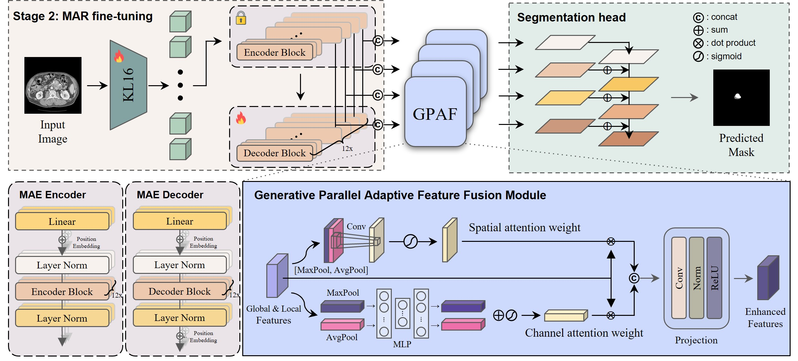

# MARSeg: Enhancing Medical Image Segmentation with MAR and Adaptive Feature Fusion

This is the official repository of MARSeg model.

## MARSeg


MARSeg is a novel segmentation framework tailored for medical images. Our method first pretrains a MAR model on large-scale CT scans, capturing both global structures and local details without relying on vector quantization. We then introduce a Generative Parallel Adaptive Feature Fusion (GPAF) module that effectively unifies spatial and channel-wise attention, thereby combining latent features from the pretrained MAE encoder and decoder. This approach preserves essential boundary information while enhancing the robustness of organ and tumor segmentation.

## Dataset
We utilize the Medical Segmentation Decathlon (MSD) dataset for training and evaluating the MARSeg model. The MSD dataset is a comprehensive collection of medical imaging data, covering multiple organs and modalities with expertly annotated segmentation labels. For our experiments, we focus on specific tasks such as organ and tumor segmentation to assess the performance of MARSeg. We resize all input images to 256 x 256 and clip the data range in the same way as nnUNet. Additionally, we split each dataset by pateint in an 8:1:1 ratio for training, validation, and testing, respectively. For more information about the MSD dataset, please refer to the official [Medical Segmentation Decathlon](http://medicaldecathlon.com/) website.

## Getting Started

### Installation
Before running the code, create and activate the Conda environment:
```
conda env create -f environment.yaml
conda activate marseg
```
### Stage 1: MAR Pre-training
In the first stage of our medical image segmentation framework, we perform pre-training of a MAR model on large-scale CT images. This step enables the model to capture essential feature representations from medical images before fine-tuning for segmentation tasks.
#### Pre-training Settings:
The MAR model is pre-trained using the following settings:
```
--img_size 256 --vae_path pretrained_models/vae/kl16.ckpt --vae_embed_dim 16 --vae_stride 16 --patch_size 1 \
--model mar_base --diffloss_d 6 --diffloss_w 1024 \
--epochs 400 --warmup_epochs 100 --batch_size 64 --blr 1.0e-4 --diffusion_batch_mul 4 \
--output_dir ${OUTPUT_DIR} \
--data_path ${IMAGENET_PATH}
```
For implementation details, refer to the [MAR repository](https://github.com/LTH14/mar).

### Stage 2: MARSeg Training
To train the MARSeg model, you can simply run the following command:
```
./train.sh
```
This script will execute the training process based on the configurations specified in the code. For additional customization, you can modify the ```train.sh``` file to suit your requirements.

## Inference
To run inference using the trained model, execute the following command:
```
./evaluate.sh
```
